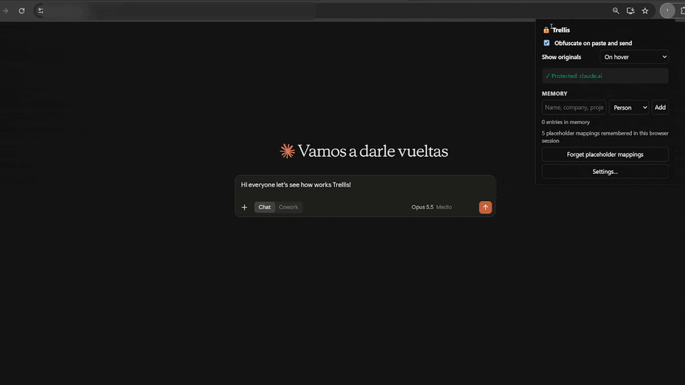

# Trellis

### Keep sensitive data out

[](https://github.com/daffi1238/Trellis/actions/workflows/test.yml)



**Keep sensitive data out of AI chatbots.** Trellis is a Chrome extension that obfuscates personal and
confidential data *before* it reaches ChatGPT, Claude, Gemini, DeepSeek, Z.ai, Mistral, Perplexity, Copilot and
other LLM chats — and shows you the original values again, only on your screen.

```
You paste:     Please email Jane Doe (jane.doe@acme.com) about server 10.0.0.12
The LLM gets:  Please email [NAME_1] [SURNAME_1] ([EMAIL_1]) about server [IPV4_1]
You see:       …the LLM's answer; hover a placeholder to see the original, or copy it with the originals
```

## Features

- **Obfuscate on paste**: the pasted text is checked before the site's editor sees it.
- **Check before sending**: text you type by hand is checked on Enter or the Send button. Matches are replaced
  in the editor and you confirm by sending again (or sending is simply blocked, if you prefer).
- **Network backstop**: if typed data that was not obfuscated is about to leave in a request (`fetch`,
  `XMLHttpRequest`, `WebSocket`, `sendBeacon`), for example because the site sent it through a control Trellis did
  not recognise, the request is blocked and you are told why. Only values you typed in the message box count, so
  the site's own requests (e.g. with your account email) are not affected.
- **Obfuscate typed text on a pause**: as a backstop that does not depend on recognising the site's Send
  control, typed data is obfuscated in the message box when you pause or leave it. A value the caret is still
  touching (e.g. half an email address) is left alone until it is complete.
- **Consistent placeholders**: the same value always becomes the same placeholder (`[EMAIL_1]`) across tabs,
  so the LLM keeps the context without seeing the data.
- **Reveal on hover**: placeholders with a known original are highlighted; hover one to see the original in a
  tooltip drawn by the extension, which the chat site's scripts cannot read. Switch the popup to *Never* to
  show the placeholders exactly as the LLM received them (handy for demos), or to *Inline* on sites you trust.
- **Copy with originals**: copying a response (Ctrl+C or the site's "Copy" button) puts the real values on
  the clipboard, without exposing them to the page.
- **Workbench**: an extension page to prepare messages and read replies away from the chat site. Only
  placeholders ever reach the chat; the originals stay inside the extension.
- **Early warnings**: typing something sensitive into the chat shows a warning right away, not only on Send.
- **In-page panel**: a small 🔒 button on the chat page lists this site's placeholders and **suggestions**, things
  that look sensitive but matched nothing (capitalized names like "Northwind Traders", codes like `HOOLI_DC`,
  host names, long numbers). *Hide* adds one to your memory and obfuscates it in the message box right away;
  *Never hide* marks a false positive. The panel lives out of the page's reach (see Privacy model).
- **Memory**: your own keywords (people, companies, clients, projects…) with a category of your choice,
  stored only in your browser. Each category becomes a placeholder label: `hooli` in category `Corp` turns
  `HOOLI_DC` into `[CORP_1]_DC`. Enable *Partial match* on an entry to also catch it inside other words
  (`HooliDC` → `[CORP_1]DC`). Add entries in Settings, from the toolbar popup, or by selecting text on any
  site → right-click → *Add to Trellis memory*.
- **Rules**: built-in regexes for emails, phone numbers, IBANs, cards, IPs, API keys, JWTs, private keys
  and `password=`-style secrets, plus your own regexes and keyword rules.
- **Generic word lists**: ~1,500 first names and ~1,150 surnames in many languages, with an exception list
  for words like *Claude*, *Ruby* or *Will*.

## Tested status

> **So far Trellis has only been tested by hand on Chrome with claude.ai.** Other browsers and sites are
> expected to work where marked as such, but have not been verified yet. Reports are welcome.

✅ tested by hand · 🧪 covered by the automated tests only (Chromium + mock chat pages) · ❌ not tested

### Browsers

| Browser | Status | Notes |
|---|:---:|---|
| Google Chrome (desktop) | ✅ | Tested by hand on claude.ai |
| Chromium | 🧪 | Runs the end-to-end suite in CI |
| Microsoft Edge, Brave, Opera, Vivaldi | ❌ | Chromium-based, expected to work |
| Firefox 140+ (ESR) | 🧪 | Automated tests on Firefox ESR 140; not tested by hand yet. See [Firefox notes](docs/store/firefox-amo.md) |
| Safari | ❌ | Not supported |

### Chat sites

| Site | Status | Notes |
|---|:---:|---|
| claude.ai | ✅ | |
| chatgpt.com | 🧪 | Its behaviour is simulated in the tests, not tested on the real site |
| gemini.google.com, aistudio.google.com | ❌ | |
| chat.deepseek.com | ❌ | |
| z.ai | ❌ | |
| chat.mistral.ai | ❌ | |
| perplexity.ai | ❌ | |
| copilot.microsoft.com | ❌ | |
| grok.com | ❌ | |
| poe.com | ❌ | |
| chat.qwen.ai | ❌ | |
| kimi.com | ❌ | |
| meta.ai | ❌ | |
| huggingface.co (HuggingChat) | ❌ | |

### Features on claude.ai (Chrome)

| Feature | Real site | Automated tests |
|---|:---:|:---:|
| **Obfuscating** | | |
| Obfuscate on paste | ✅ | 🧪 |
| Long pastes (attachment card) | ✅ | 🧪 |
| HTML-only paste, pasted/dropped text files | ❌ | 🧪 |
| Drag and drop | ❌ | 🧪 |
| Check before sending (Enter / Send button) | ❌ | 🧪 |
| Non-standard Send controls (e.g. `<div role="button">`) | ❌ | 🧪 |
| Obfuscate typed text on a pause | ❌ | 🧪 |
| Warning while typing | ❌ | 🧪 |
| Network backstop (blocks unobfuscated typed data) | ❌ | 🧪 |
| **Showing and copying originals** | | |
| Placeholders highlighted and revealed on hover | ✅ | 🧪 |
| Placeholders inside code blocks | ✅ | 🧪 |
| Copy button returns the original values | ✅ | 🧪 |
| "Never" mode (show placeholders only) | ❌ | 🧪 |
| Inline mode (opt-in) | ❌ | 🧪 |
| Clipboard-read permission guard | ❌ | 🧪 |
| **Memory, panel and workbench** | | |
| Memory: context menu and popup | ❌ | 🧪 |
| Memory: partial match | ❌ | 🧪 |
| In-page panel: suggestions, Hide, Never hide | ❌ | 🧪 |
| Workbench | ❌ | 🧪 |
| **Security** | | |
| The page cannot read revealed values (DOM, `window.find`, recorders) | ❌ | 🧪 |
| Placeholders only resolve on the site that created them | ❌ | 🧪 |
| The page cannot trigger a copy of originals without a user gesture | ❌ | 🧪 |
| No trace on pages where Trellis has not acted | ❌ | 🧪 |
| Orphaned copies stop after the extension is reloaded | ❌ | 🧪 |
| Default rules resist hostile input (no catastrophic backtracking) | ➖ | 🧪 |
| Imported settings files are sanitized | ➖ | 🧪 |

➖ not something you can check by hand in the chat. The security rows are attacks run from the page's point of
view in `test/e2e/security.spec.js`, `gesture.spec.js`, `stealth.spec.js` and `egress.spec.js`, including the two
issues (T1, T2) found in an external security review.

## Install

Trellis is not on the Chrome Web Store yet (the submission kit is in [`docs/store/`](docs/store/chrome-web-store.md)).
To install it from source:

1. Clone or download this repository.
2. Open `chrome://extensions` and turn on **Developer mode**.
3. Click **Load unpacked** and select the repository folder.
4. Reload any open chat tabs.

To update: `git pull`, then click ↻ on the extension in `chrome://extensions`.

**Firefox (140 or later):** run `npm run package:firefox`, then in `about:debugging` → *This Firefox* →
*Load Temporary Add-on…* select `dist/firefox/manifest.json` (it stays until Firefox restarts), or run
`npx web-ext run --source-dir dist/firefox`. See the [Firefox notes](docs/store/firefox-amo.md) for the differences.

Permissions: the configured chat sites (plus any you add), storage, context menu and clipboard write. Trellis
never asks to read your clipboard.

## Workbench

For the most sensitive data, do not type or paste it in the chat at all. Open the workbench (toolbar popup →
*Open workbench…*):

1. Pick the site (e.g. `claude.ai`) and write or paste your text. **Obfuscate** and **Copy obfuscated text**.
2. Paste it into the chat. The chat only ever receives placeholders.
3. Copy the LLM's reply (it contains placeholders) and paste it into the workbench to reveal it.

The workbench shares the site's placeholders, so `[EMAIL_1]` means the same in the workbench and on the site.
If you copy the revealed reply, originals are on your system clipboard: use **Clear clipboard** before going
back to a chat tab.

## How it works

| Situation | What Trellis does |
|---|---|
| You paste text containing matches | The paste is intercepted and the obfuscated text is inserted instead |
| You type something sensitive and press Enter/Send | Sending is cancelled, matches are replaced in the editor, you send again |
| The LLM answers with `[EMAIL_1]` | The placeholder is highlighted; hovering it shows the original email |
| You copy the answer | The clipboard gets the original values |
| You drop text into the chat | It is obfuscated like a paste |
| Nothing matches | Nothing changes: normal paste, formatting preserved |

### Replacement modes

| Mode | Example |
|---|---|
| Consistent placeholder (default) | `jane@acme.com` → `[EMAIL_1]` — the only mode that can be restored |
| Fixed text | `[REDACTED]` (configurable) |
| Asterisks | `*************` |

Each rule can also define its own replacement text.

### Matching

- Keywords, memory and word lists ignore case, accents and spacing: `Jose Nunez` also matches `JOSÉ  NÚÑEZ`.
- Multi-word entries are supported (`De la Cruz`, `Procter & Gamble`).
- Word-list lookups use a hash set per word, so lists with hundreds of thousands of entries stay fast
  (200,000 entries over 100 KB of text: ~0.2 s).
- Names and surnames only match capitalized words by default, to avoid false positives ("a white rose").
- When several rules match the same text, the longest match wins.

## Privacy model

See also the [privacy policy](PRIVACY.md).

Trellis treats the chat site itself as untrusted: it is the party your data is hidden from.

- **Nothing leaves your browser.** Trellis makes no network requests of its own.
- **Pasted and dropped text is obfuscated before the page sees it.** Trellis intercepts the event in the capture
  phase, before any script of the site, and only hands the page the obfuscated text.
- **Original values are never written where the page can read them.** In the default *hover* mode the page
  keeps the placeholders; the original is drawn on a canvas inside a closed shadow root created by the extension,
  which the site's scripts cannot reach, search (`window.find`) or select.
- **Placeholders are scoped per site.** A placeholder created on claude.ai can only be revealed or copied on
  claude.ai. Another site printing `[EMAIL_1]` gets nothing. Content scripts never read the mapping store
  directly: the background hands each tab only the mappings of its own site.
- **Copying requires a real user gesture.** The site's scripts cannot make Trellis put originals on the
  clipboard on their own.
- **No originals on the clipboard for sites that can read it.** If a site has been granted clipboard-read
  permission, copying there keeps the placeholders and Trellis tells you why.
- **Your memory lives in `chrome.storage.local`**, not in this repository and not reachable by web pages.
  The settings export includes it, so keep exported files private.
- **Placeholder ↔ original mappings live in `chrome.storage.session`**: in memory only, cleared when the browser
  closes. You can clear them from the popup at any time.

These properties are covered by the end-to-end tests in `test/e2e/security.spec.js` and `gesture.spec.js`,
which attack Trellis from the page's point of view.

### What the site can notice about Trellis

Trellis tries to leave as little trace as possible, and the end-to-end tests in `test/e2e/stealth.spec.js` check it:

- **On a page where Trellis has not acted, there is no trace**: no elements, highlights, style sheets or frames.
- **Its UI only exists while in use.** Notices and tooltips are removed when hidden; the panel is created when
  opened. They live in closed shadow roots, and their text is drawn on canvases or kept in the cross-origin panel,
  so the page cannot read or search it. Identifiers are random per page.
- **The panel cannot be probed.** It is an extension page in an `<iframe>`; web pages cannot fetch it
  (`use_dynamic_url`), read its URL (closed shadow root) or its content (cross-origin).

What remains observable:

- **The page-world scripts.** Two small scripts run in the page's context: the Copy-button bridge wraps
  `navigator.clipboard.writeText`/`write`, and the network backstop wraps `fetch`, `XMLHttpRequest`, `WebSocket`
  and `sendBeacon`. They hand text the page already has to the extension through DOM events and never receive
  rules, memory or originals. A site that inspects those functions can notice them.
- **The placeholders themselves.** `[EMAIL_1]` in a message is a recognizable pattern, both for the site and for
  the LLM. The *mask* mode (`[REDACTED]`) is less specific.
- **Its effects**: the pasted text differs from the clipboard, a send can be cancelled, and a few elements appear
  while Trellis shows something (the 🔒 button while this page has placeholders or suggestions; highlights use the
  CSS Custom Highlight API and one extra style sheet, unless highlighting is turned off).

### What Trellis cannot protect

- **Typed text is visible to the site as you type.** Trellis warns you as soon as you type something sensitive
  and stops the message on Send, but the site's scripts receive every keystroke and may store drafts, and the
  editor's undo history keeps the original. Paste sensitive text, or use the workbench.
- **The clipboard belongs to your operating system.** A site with clipboard-read permission can read it while its
  tab has focus, which is exactly when you use it; clipboard managers and OS clipboard history/sync can keep a
  copy too. Clear the clipboard after copying originals.
- **Inline mode (opt-in) writes originals into the page**, where the site's scripts can read them. Use it only
  on sites you trust.
- **Copied originals are on your clipboard.** A site you granted clipboard-read permission could read them.
- **Your own compromised browser or other malicious extensions** are out of scope.

## Limitations

- **The Send control is recognised heuristically**: known send buttons, plus any button-like control (`button`,
  `role="button"`, `input[type=submit]`) next to the message box. Enter is always intercepted, typed data is
  obfuscated when you pause, and the network backstop blocks requests with typed data that was not obfuscated.
- **The network backstop is a safety net, not a barrier against a hostile site**: it does not see requests made
  from Web Workers or with streamed bodies, and a site that wanted to could bypass it.
- **Files uploaded with the site's own upload button** (PDF, Word, images…) are not obfuscated. Pasted or dropped
  text files, and clipboard content that only has HTML, are converted to text and checked like any paste.
- **Rules and lists cannot catch everything.** Names that are not in any list and data in formats no rule covers
  go through unchanged: add them to your memory (the in-page panel suggests likely candidates).
- **Placeholders the LLM rewrites** (e.g. `CORP_1_DC` instead of `[CORP_1]_DC`) may not be recognised.
- **After the browser restarts**, placeholders in old conversations can no longer be revealed.
- **Sites change their markup**; if something stops working on a specific site, please open an issue.

## Configuration

Everything is in the extension's **Settings** page (toolbar popup → *Settings…*):

- **Memory**: your keywords and categories (each category becomes a placeholder label, e.g. `[CLIENT_1]`),
  whole-word or partial match per entry, and import/export (`category<TAB>term[<TAB>partial]`).
- **Rules**: enable/disable, edit or add regex and keyword rules; test them live in *Try it*.
- **Generic word lists**: toggle them, and add exceptions for false positives.
- **Domains**: the chat sites Trellis runs on; add any other site (Chrome asks for permission).

### Word list files

`wordlists/*.txt`: one entry per line, `#` starts a comment. Edit them and reload the extension.

| File | Content |
|---|---|
| `first-names.txt` | First names in many languages |
| `surnames.txt` | Surnames, including compound ones |
| `exceptions.txt` | Never obfuscated by the generic lists (AI assistant names, tech terms, common English words) |

Do not put private names here: use the Memory instead, which never ends up in the repository.

## Development

```bash
npm run check      # manifest, encoding and JavaScript syntax
npm test           # unit tests of the engine (node --test, no dependencies)

npm run package    # checks + unit tests, then builds dist/trellis-<version>.zip for the Chrome Web Store
npm run package:firefox   # same for Firefox: dist/firefox/ and dist/trellis-firefox-<version>.zip, plus web-ext lint
npm run test:firefox      # Firefox tests (Firefox ESR/Developer Edition/Nightly + Selenium)

npm ci                                  # once: installs Playwright
npx playwright install chromium         # once: downloads Chromium
npm run test:e2e                        # end-to-end tests
```

The end-to-end tests (`test/e2e/`) load the unpacked extension in Chromium and drive mock chat pages that
behave like Claude (rich-text editor, attachment cards for long pastes, streamed replies, Copy buttons) and
ChatGPT (textarea inside a form). No real chat site is contacted. They check what would actually leave the
browser: pasting, the check before sending, local restore, copying, memory, the settings page and the popup.

Everything runs automatically on every push and pull request (GitHub Actions): unit tests on Node 20 and 22,
the end-to-end suite on Chromium, and the Firefox build (web-ext lint + Firefox tests on Firefox ESR). When the end-to-end job fails, its report and traces are attached to
the run (`npx playwright show-trace <trace.zip>`).

| File | Purpose |
|---|---|
| `manifest.json` | Manifest V3; default LLM domains plus optional permissions for extra sites |
| `background.js` | Registers the content scripts, compiles word lists and memory, assigns placeholders, context menu |
| `content.js` | Paste interception, check before sending, local restore, copy with originals |
| `clipboard-main.js` | Runs in the page to intercept the sites' "Copy" buttons (never sees originals) |
| `egress-main.js` | Runs in the page: network backstop, asks the extension before each request is sent |
| `panel.*` | In-page panel (extension page in a cross-origin iframe) |
| `obfuscator.js` | Obfuscation engine: pure JS, no DOM, unit-tested with node |
| `defaults.js` | Default settings, rules and shared helpers |
| `options.*`, `popup.*` | User interface |
| `workbench.*` | Workbench page: obfuscate and reveal inside the extension |
| `welcome.html` | Shown on install: what Trellis reads and that nothing leaves the browser |
| `icons/` | Extension icons (`icon512.png` is the source for store graphics) |
| `scripts/` | `package.js` (store zip) and `check-encoding.js` |
| `docs/store/` | Store listing texts and graphics: Chrome Web Store and Firefox Add-ons (AMO) |
| `wordlists/` | Generic word lists |
| `test/` | Unit tests (`*.test.js`), end-to-end tests on Chromium (`e2e/`) and on Firefox (`firefox/`) |

Contributions are welcome, especially regexes for other countries' ID and phone formats, and word-list
improvements.

## License

[MIT](LICENSE)
